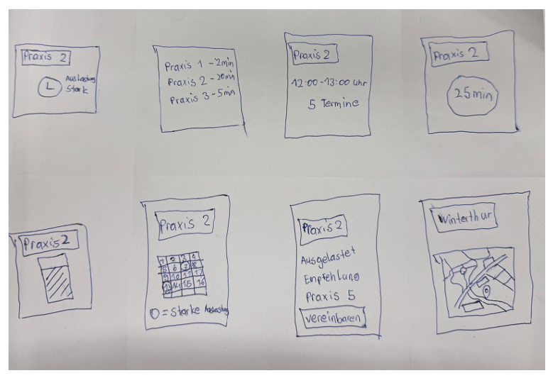
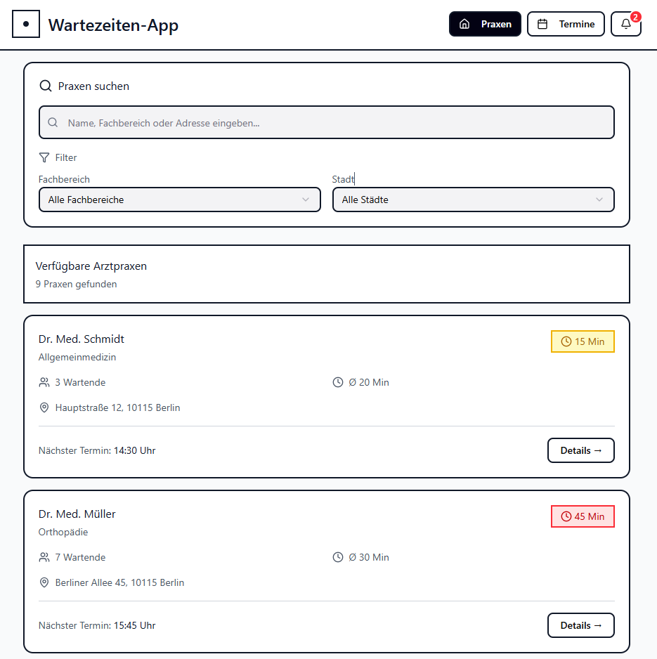
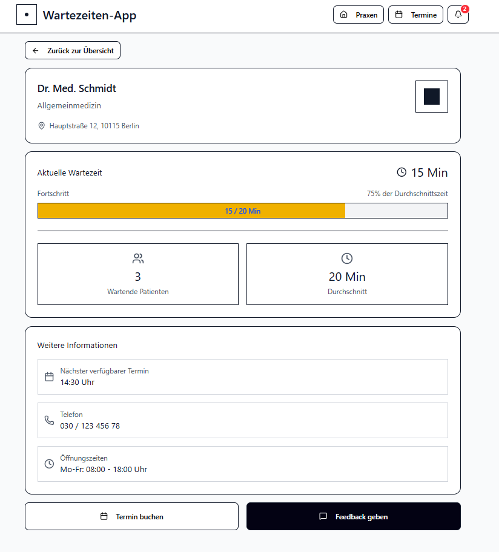
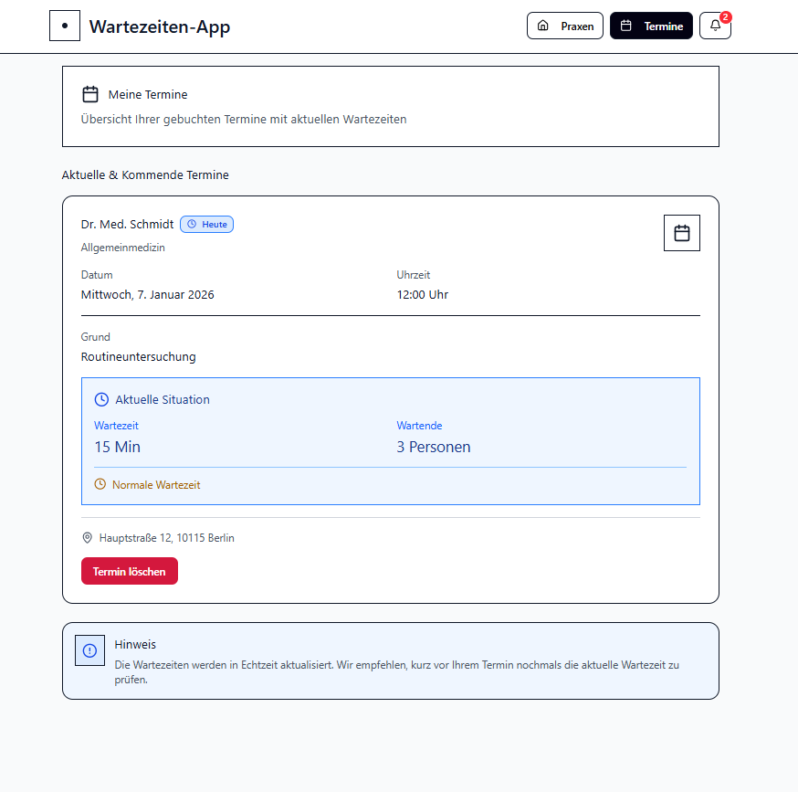
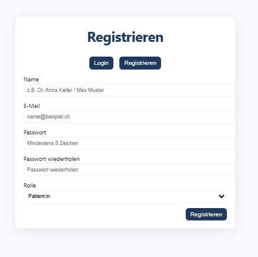
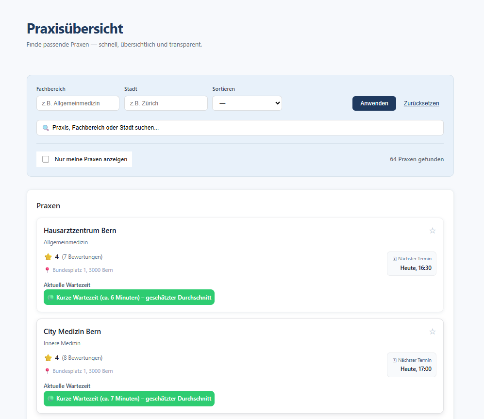
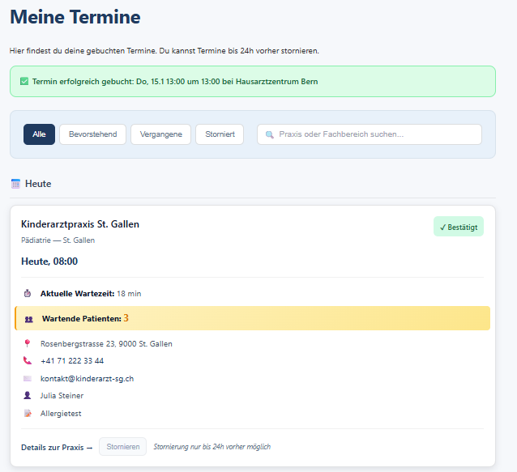
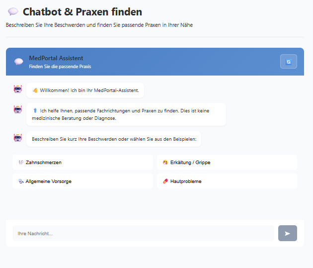
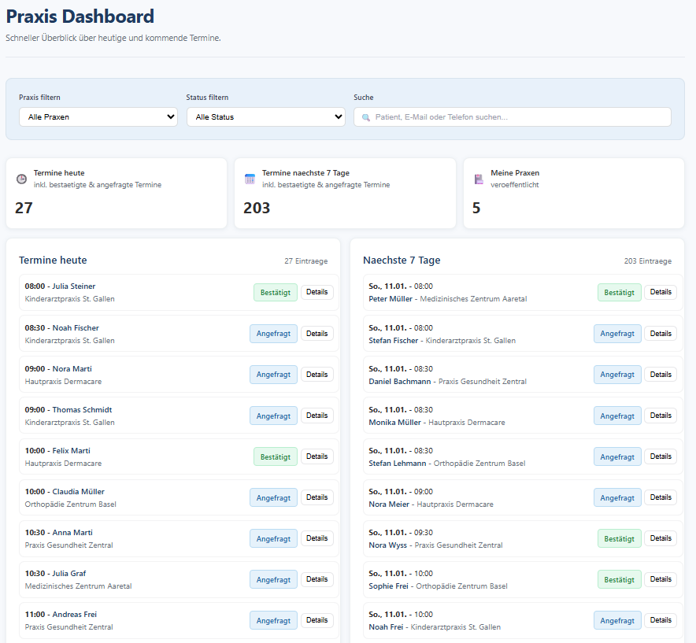
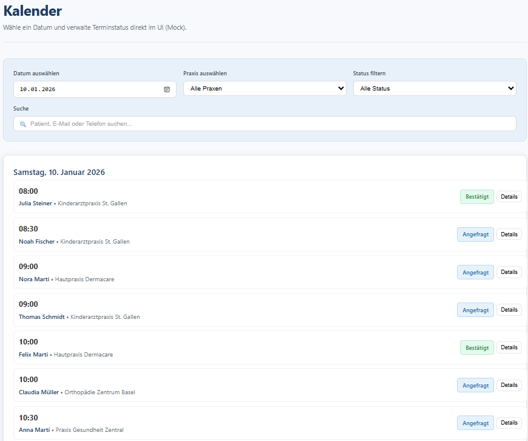

# Projektdokumentation – MedPortal

## Inhaltsverzeichnis

1. [Einordnung & Zielsetzung](#1-einordnung--zielsetzung)
2. [Zielgruppe & Stakeholder](#2-zielgruppe--stakeholder)
3. [Anforderungen & Umfang](#3-anforderungen--umfang)
4. [Vorgehen & Artefakte](#4-vorgehen--artefakte)
    - [Understand & Define](#41-understand--define)
    - [Sketch](#42-sketch)
    - [Decide](#43-decide)
    - [Prototype](#44-prototype)
    - [Validate](#45-validate)
5. [Erweiterungen [Optional]](#5-erweiterungen-optional)
6. [Projektorganisation [Optional]](#6-projektorganisation-optional)
7. [KI‑Deklaration](#7-ki‑deklaration)
8. [Anhang [Optional]](#8-anhang-optional)

## 1. Einordnung & Zielsetzung

- **Kontext & Problem:**

    Wartezeiten in Arztpraxen sind für Patientinnen und Patienten häufig intransparent und schwer planbar. Dies führt zu Frustration, unnötigen Leerzeiten und ineffizienten Praxisbesuchen. Gleichzeitig fehlt eine zentrale, nutzerfreundliche Übersicht, die es ermöglicht, Praxen gezielt zu vergleichen und Termine strukturiert zu planen und zu verwalten.

- **Ziele:**

    Ziel ist die Entwicklung eines interaktiven Web-Prototyps, der eine praxisnahe End-to-End-Nutzung abbildet. Patientinnen und Patienten sollen Praxen finden, filtern und vergleichen sowie Termine buchen und verwalten können. Ergänzend ermöglicht eine rollenbasierte Sicht Praxen die Verwaltung von Praxiseinträgen und Terminen innerhalb derselben Anwendung. Der Prototyp unterstützt eine transparente Entscheidungsfindung und eine effizientere Terminplanung.
 
- **Abgrenzung:**

    Der Prototyp stellt kein produktives Medizinsystem dar. Medizinische Behandlungsprozesse, Abrechnungen sowie Integrationen in bestehende Praxis- oder Spitalsysteme sind nicht Bestandteil des Umfangs. Sämtliche Wartezeiten, Verfügbarkeiten und Termindaten werden mit prototypischen (Mock-)Daten dargestellt und dienen ausschliesslich der Demonstration von Benutzeroberfläche, Systemlogik und typischen Nutzungsszenarien.

## 2. Zielgruppe & Stakeholder

- **Primäre Zielgruppe:**

    Die primäre Zielgruppe sind Patientinnen und Patienten, die Arztpraxen suchen und ihre Termine effizient planen möchten. Sie profitieren insbesondere von einer transparenten Darstellung von Wartezeiten, Filtermöglichkeiten nach Standort und Fachbereich sowie einer zentralen Übersicht zur Verwaltung ihrer Termine.

- **Weitere Stakeholder:**

    Weitere relevante Stakeholder sind Ärztinnen und Ärzte sowie Praxispersonal, die den Prototyp zur Verwaltung von Praxiseinträgen, Terminen und Patientendaten nutzen. Sie profitieren von einer strukturierten Übersicht über anstehende Termine und einer zentralen Oberfläche zur Unterstützung administrativer Aufgaben.

- **Annahmen:**

    Im Rahmen des Prototyps wird angenommen, dass eine transparente Darstellung von Wartezeiten und eine zentrale Terminübersicht den Planungsaufwand für Patientinnen und Patienten reduzieren und die Entscheidungsfindung erleichtern. Zudem wird davon ausgegangen, dass rollenbasierte Ansichten für Patientinnen und Patienten sowie Praxen die Benutzerführung verbessern und typische Nutzungsszenarien realistisch abbilden. Der integrierte Chatbot wird als unterstützendes Orientierungselement verstanden, das die Suche nach passenden Fachrichtungen erleichtert, ohne medizinische Beratung zu ersetzen.

## 3. Anforderungen & Umfang

- **Kernfunktionalität (Mindestumfang):** 

    **Patienten-Workflow (Haupt-Workflow):**

    Patientinnen und Patienten können eine Übersicht von Arztpraxen aufrufen und diese nach Fachbereich und Stadt filtern sowie vergleichen. Zu jeder Praxis werden zentrale Informationen wie Adresse, Fachgebiet, Bewertungen und geschätzte Wartezeiten angezeigt. Nach Auswahl einer Praxis kann ein Termin erstellt werden. Zusätzlich steht eine persönliche Terminübersicht zur Verfügung, in der bestehende Termine eingesehen, bearbeitet oder storniert werden können.

    **Praxis-Workflow:**

    Angemeldete Praxen verfügen über ein eigenes Dashboard mit einer Übersicht über aktuelle und kommende Termine. Termine können nach Datum gefiltert sowie bestätigt oder abgesagt werden. Zudem können Praxen ihre eigenen Praxiseinträge erfassen und bestehende Informationen bearbeiten.

- **Akzeptanzkriterien:**

    Der Prototyp gilt als funktionsfähig, wenn die definierten Workflows für beide Rollen vollständig und ohne technische Fehler durchführbar sind. Insbesondere gelten folgende Kriterien:

    - Patientinnen und Patienten können Praxen aufrufen, filtern und eine Praxis auswählen.

    - Patientinnen und Patienten können einen Termin buchen und dieser erscheint korrekt in der persönlichen Terminübersicht.

    - Bestehende Termine können angezeigt und storniert werden.

    - Praxen können sich anmelden und auf ein eigenes Dashboard zugreifen.

    - Praxen können Termine anzeigen, filtern sowie bestätigen oder absagen.

    - Praxen können eigene Praxiseinträge erstellen und bearbeiten.

    Alle beschriebenen Funktionen sind innerhalb des Prototyps ohne Seitenabbrüche und ohne Fehlermeldungen nutzbar. 

- **Erweiterungen:** 

    Über den verbindlichen Mindestumfang hinaus wurden mehrere funktionale Erweiterungen umgesetzt, die zusätzliche Nutzungsperspektiven abbilden und die Praxisnähe des Prototyps erhöhen.

    -  **Rollenlogik mit erweiterten Praxisfunktionen:**  
    Neben dem Haupt-Workflow für Patientinnen und Patienten wurde ein zusätzlicher Praxis-Workflow umgesetzt. Praxen verfügen über ein eigenes Dashboard mit spezifischen Funktionen zur Verwaltung von Terminen, Praxiseinträgen und zugehörigen Daten.

    - **Patientenverwaltung für Praxen:**  
    Praxen können eine Übersicht aller zugeordneten Patientinnen und Patienten aufrufen. Die Liste ist durchsuch- und filterbar und ermöglicht den Zugriff auf detaillierte Patienteninformationen wie Kontaktdaten, Adresse, Versicherungsangaben und hinterlegte Krankenkasseninformationen.

    - **Patienten-Detailansicht mit medizinischen Notizen:**  
    Für jede Patientin und jeden Patienten steht eine Detailansicht zur Verfügung, in der Praxen zusätzliche medizinische Hinweise (z. B. Allergien oder relevante Vorerkrankungen) prototypisch erfassen und pflegen können.

    - **Erweiterte Profildaten für Patientinnen und Patienten:**  
    Neben Basisinformationen können zusätzliche Angaben wie Krankenkasse, Versicherungsnummer sowie eine hinterlegte Krankenkassenkarte verwaltet werden, um die Realitätsnähe des Prototyps zu erhöhen.

    - **Chatbot zur unterstützten Praxisauswahl:**  
    Ein textbasierter Chatbot ermöglicht es Patientinnen und Patienten, Beschwerden zu beschreiben und darauf basierend passende Praxen vorgeschlagen zu bekommen. Diese Funktion ergänzt den klassischen Such- und Filterprozess um eine alternative Interaktionsform.

    Diese Erweiterungen sind nicht zwingend für den Haupt-Workflow erforderlich, erweitern jedoch den Funktionsumfang des Prototyps und zeigen zusätzliche Aspekte einer realitätsnahen Anwendung im Sinne der Lehrveranstaltung auf.

## 4. Vorgehen & Artefakte

### 4.1 Understand & Define
- **Ausgangslage & Ziele:**

    Wartezeiten in Arztpraxen sind für Patientinnen und Patienten oft intransparent und erschweren eine verlässliche Terminplanung. Ziel des Projekts ist die Konzeption eines interaktiven Web-Prototyps, der eine praxisnahe End-to-End-Nutzung abbildet und es ermöglicht, Praxen zu finden, zu vergleichen, eine Praxis auszuwählen sowie Termine zu buchen und zu verwalten. Damit werden Problemraum und Zielsetzung klar definiert und eine fundierte Basis für die weiteren Projektphasen geschaffen.

- **Zielgruppenverständnis:**

    Das Zielgruppenverständnis basiert auf einer Analyse des bestehenden Problems im Gesundheitskontext sowie einer frühen Auseinandersetzung mit dem Ist-Zustand. Im Fokus stehen zwei zentrale Nutzergruppen: Patientinnen und Patienten, die eine geeignete Arztpraxis mit möglichst kurzer Wartezeit und verfügbarer Terminoption suchen, sowie Ärztinnen und Ärzte beziehungsweise Praxen, die Termine, Praxisinformationen und Anfragen effizient verwalten möchten. Die Bedürfnisse beider Rollen wurden entlang einer klaren Problemdefinition erfasst und durch leitende Fragestellungen im Sinn des How-might-we-Ansatzes strukturiert.

- **Wesentliche Erkenntnisse:**

    Wesentliche Erkenntnisse aus der Analysephase zeigen, dass Transparenz nur dann wirksam ist, wenn sie auf einen Blick verständlich vermittelt wird. 

    Wartezeiten müssen als klare Kennzahl dargestellt und durch visuelle Statusindikatoren ergänzt werden, um schnelle und informierte Entscheidungen zu ermöglichen.

    Die Suche nach geeigneten Praxen muss eine rasche Eingrenzung erlauben. Zentrale Filterkriterien wie Fachbereich und Stadt sind essenziell und sollten durch eine sinnvolle Sortierung ergänzt werden, damit Praxen effizient verglichen werden können.

    Der grösste Mehrwert für Nutzerinnen und Nutzer entsteht durch einen durchgängigen, logisch aufgebauten Ablauf. Dieser reicht von der Praxisübersicht über Detailinformationen bis hin zur Terminbuchung und einer persönlichen Terminverwaltung mit Anzeige-, Änderungs- und Stornomöglichkeiten.

    Aus Sicht der Praxen ist eine kompakte und übersichtliche Steuerung von Terminen zentral. Dafür sind eine zeitliche Übersicht sowie einfache Filter- und Statusfunktionen notwendig, um den Praxisalltag effizient zu unterstützen.

    Ein Chatbot erweist sich als sinnvoller, niedrigschwelliger Einstieg, sofern er klar auf die Einordnung von Beschwerden und die Empfehlung passender Praxen beschränkt ist und keine medizinischen Diagnosen suggeriert.

    Für den Prototypen wurde festgelegt, dass sämtliche Inhalte mit Mockdaten dargestellt werden. Der Fokus liegt auf der Visualisierung von Benutzeroberfläche, Workflows und Rollenlogik und nicht auf der Abbildung produktiver medizinischer Prozesse.

### 4.2 Sketch
- **Variantenüberblick:**

    In der Sketch-Phase wurden mehrere grobe Lösungsvarianten entwickelt, um unterschiedliche Möglichkeiten der Darstellung von Wartezeiten, Praxisübersichten und Termininteraktionen zu untersuchen. Die Skizzen entstanden im Rahmen der Crazy-8s-Methode und fokussierten sich auf verschiedene UI-Ansätze wie Listenansichten, visuelle Wartezeitanzeigen (z. B. Balken oder Zahlen), Kalenderdarstellungen sowie alternative Übersichten von Praxen und Terminen.

    Die Sketch-Phase diente dabei bewusst der schnellen Exploration des Lösungsraums, ohne frühe Festlegung auf eine konkrete Ausgestaltung.

- **Skizzen:**

    
    
    Die Skizzen zeigen unterschiedliche Ausprägungen derselben Kernidee: eine transparente und schnell erfassbare Darstellung von Wartezeiten und verfügbaren Terminen. Unterschiede bestanden insbesondere in der visuellen Gewichtung der Wartezeit (reine Zahl vs. Fortschrittsbalken), der Anordnung der Informationen (Praxisliste vs. Kalenderansicht) sowie im Grad der Interaktivität.
    Auf Basis des erhaltenen Feedbacks aus der Sketch-&-Decide-Phase wurde die Variante einer übersichtlichen Praxisliste mit klar dargestellten Wartezeiten und Terminangaben bevorzugt, da sie den direkten Vergleich mehrerer Praxen am besten unterstützt. Hinweise aus dem Feedback, wie eine stärkere visuelle Hervorhebung der Wartezeit und eine klare Strukturierung der Termine, flossen in die Weiterentwicklung Richtung UI-Prototyp ein.

### 4.3 Decide
- **Gewählte Variante & Begründung:**

    Basierend auf den in der Sketch-Phase entwickelten Varianten wurde eine listenbasierte Darstellung von Praxen und Terminen mit klaren Kennzahlen zur Wartezeit gewählt. Ausschlaggebend für diese Entscheidung waren die Kriterien Verständlichkeit, Vergleichbarkeit und Effizienz. Die Listenansicht ermöglicht es Nutzerinnen und Nutzern, relevante Informationen wie Fachrichtung, Standort, Wartezeit und nächste verfügbare Termine auf einen Blick zu erfassen und mehrere Praxen schnell miteinander zu vergleichen. Varianten mit komplexeren Darstellungen (z. B. rein grafische Auslastungsanzeigen oder Kartenansichten) wurden bewusst verworfen, da sie im Kontext des Prototyps keinen zusätzlichen Mehrwert für die Entscheidungsfindung boten und die Übersichtlichkeit reduziert hätten. Die gewählte Lösung entspricht dem in der Vorlesung empfohlenen Prinzip, die verständlichste und nutzerzentrierteste Variante umzusetzen.

- **End‑to‑End‑Ablauf:**

    Der End-to-End-Workflow beginnt mit der Praxisübersicht, in der Patientinnen und Patienten Praxen nach Fachbereich, Stadt und weiteren Kriterien filtern und vergleichen können. Von dort gelangen sie zur Detailseite einer Praxis mit erweiterten Informationen, geschätzter Wartezeit, Bewertungen und verfügbaren Zeitslots. Anschliessend kann ein Termin gebucht werden. Gebuchte Termine erscheinen in der persönlichen Terminübersicht, wo sie eingesehen, bei Bedarf bearbeitet oder – unter Einhaltung der definierten Regeln – storniert werden können. Für Praxen erstreckt sich der Ablauf vom Dashboard mit Terminübersicht über die Kalenderansicht bis zur gezielten Bearbeitung einzelner Termine sowie der Verwaltung von Praxiseinträgen und Patientendaten. Damit wird ein durchgängiger, rollenbasierter End-to-End-Ablauf abgebildet.

- **Referenz‑Mockup:**

    

    Der Screen zeigt die Praxisübersicht als zentralen Einstiegspunkt der Anwendung. Patientinnen und Patienten können Arztpraxen über eine freie Suche sowie Filter nach Fachbereich und Stadt eingrenzen und vergleichen. Pro Praxis werden die geschätzte aktuelle Wartezeit, die Anzahl wartender Personen sowie der nächste verfügbare Termin kompakt dargestellt, sodass Unterschiede zwischen Praxen auf einen Blick erkennbar sind. Von dieser Übersicht aus kann direkt zur Detailansicht einer Praxis navigiert werden, womit der gewählte End-to-End-Workflow konsequent gestartet wird.

    ---

    

    Diese Ansicht zeigt die Detailseite einer ausgewählten Arztpraxis. Nutzerinnen und Nutzer erhalten hier eine vertiefte Übersicht über die aktuelle Situation in der Praxis. Zentral dargestellt wird die geschätzte aktuelle Wartezeit, ergänzt durch eine visuelle Fortschrittsanzeige, die den aktuellen Stand im Verhältnis zur durchschnittlichen Wartezeit darstellt. Zusätzlich wird angezeigt, wie viele Patientinnen und Patienten sich aktuell im Warteprozess befinden, um die Situation besser einschätzen zu können.

    Ergänzend werden weitere praxisrelevante Informationen wie Adresse, Öffnungszeiten, Telefonnummer sowie der nächste verfügbare Termin angezeigt. Von dieser Seite aus kann direkt ein Termin gebucht werden. Die Detailansicht dient damit als Entscheidungsgrundlage vor der Terminbuchung und unterstützt das Projektziel, Wartezeiten transparent und verständlich darzustellen.

    --- 
    
    

    Nach Abschluss der Terminbuchung erhalten Nutzerinnen und Nutzer eine eindeutige Rückmeldung, dass der Termin erfolgreich erfasst wurde und der Buchungsvorgang abgeschlossen ist.

    Die wichtigsten Termindaten werden kompakt zusammengefasst, darunter Praxis, Fachbereich, Datum, Uhrzeit, Patient und Besuchsgrund. Zusätzlich wird darauf hingewiesen, dass eine Bestätigung per E-Mail versendet wurde.

    Die Bestätigungsansicht stellt sicher, dass der Buchungsprozess klar abgeschlossen ist und der Termin anschliessend in der persönlichen Terminübersicht weiterverfolgt werden kann.

    ---
    
    

    Im Mittelpunkt dieser Ansicht steht die persönliche Terminübersicht der Patientinnen und Patienten. Sie dient der zentralen Verwaltung bereits gebuchter Termine und verknüpft Terminangaben mit der aktuellen Wartezeitsituation.

    Zu jedem Termin werden die relevanten Informationen übersichtlich dargestellt, darunter Praxis, Fachbereich, Datum, Uhrzeit, Besuchsgrund und Adresse. Ergänzend wird die aktuelle Situation visualisiert, bestehend aus geschätzter Wartezeit und Anzahl aktuell wartender Personen. Dadurch erhalten Nutzerinnen und Nutzer eine konkrete und vergleichbare Einschätzung der aktuellen Auslastung der Praxis.

    Der Terminstatus wird visuell eingeordnet, um Abweichungen vom Durchschnitt schnell erkennbar zu machen. Über diese Ansicht können Termine im definierten Rahmen gelöscht werden. Die Terminübersicht unterstützt damit das Projektziel, Transparenz zu schaffen und die Planbarkeit von Praxisbesuchen zu verbessern.

### 4.4 Prototype
- **Kernfunktionalität:** 

    Die Kernfunktionalität des Prototyps bildet einen durchgängigen, rollenbasierten End-to-End-Workflow für Patientinnen und Patienten sowie für Praxen ab.

    Patientinnen und Patienten können Arztpraxen suchen, nach Fachbereich und Standort filtern und miteinander vergleichen. Nach Auswahl einer Praxis stehen detaillierte, entscheidungsrelevante Informationen zur Verfügung, auf deren Basis direkt ein Termin gebucht werden kann. Gebuchte Termine erscheinen in einer persönlichen Terminübersicht und können im definierten Rahmen eingesehen und verwaltet werden.

    Für Praxen steht ein eigenes Dashboard zur Verfügung. Dort werden aktuelle und kommende Termine übersichtlich dargestellt und können nach Datum oder Praxis gefiltert werden. Zusätzlich können Praxiseinträge verwaltet und bei Bedarf angepasst werden.

    Damit wird der zentrale Nutzungsablauf für beide Rollen vollständig und ohne Unterbrüche abgebildet..  
- **Deployment:** _[URL]_  

#### 4.4.1. Entwurf (Design)
- **Informationsarchitektur:** 

    Die Informationsarchitektur des Prototyps ist rollenbasiert aufgebaut und orientiert sich an zwei klar getrennten Nutzungskontexten: Patientinnen und Patienten sowie Praxen. Beide Rollen arbeiten mit einer übersichtlichen Top-Navigation, die den jeweils wichtigsten Aufgabenfluss unterstützt und einen schnellen Zugriff auf zentrale Funktionen ermöglicht.

    In der Patientenrolle steht die durchgängige End-to-End-Nutzung im Vordergrund. Die Navigation führt zu einer Praxisübersicht, in der Praxen gesucht, gefiltert und miteinander verglichen werden können, zu einer persönlichen Terminübersicht sowie zu einer Profilseite zur Verwaltung persönlicher Angaben. Der primäre Navigationsfluss ist konsequent auf die Schritte Praxisauswahl, Informationssichtung und Terminbuchung ausgerichtet.

    Ergänzend ist ein Chatbot als optionale, unterstützende Funktion integriert. Dieser dient der Orientierung, indem Beschwerden beschrieben werden können und darauf basierend passende Praxen vorgeschlagen werden. Der Chatbot ist bewusst nicht Teil des primären Navigationsflusses, sondern ergänzt die klassische Suche als alternative Interaktionsmöglichkeit.

    In der Praxisrolle liegt der Fokus auf Verwaltung und Steuerung. Die Navigation umfasst ein Dashboard als Einstieg, eine Kalenderansicht zur zeitlichen Terminübersicht, eine Patientenübersicht sowie den Bereich „Meine Praxen“ zur Verwaltung von Praxiseinträgen. Zusätzlich steht auch hier eine Profilseite zur Verfügung. Die Struktur unterstützt praxisinterne Aufgaben wie Terminverwaltung, Patientenübersicht und Pflege von Praxisinformationen.

    Zusätzlich ist die Informationsarchitektur bewusst so gestaltet, dass Inhalte zwischen Seiten logisch miteinander verknüpft sind. Wo immer Namen oder zentrale Objekte angezeigt werden, sind diese als direkte Navigationselemente nutzbar. In der Praxisrolle führt beispielsweise ein Klick auf einen Patientennamen in Terminlisten oder im Kalender direkt zur entsprechenden Patientendetailansicht. In der Patientenrolle kann umgekehrt aus der Terminübersicht heraus der Name der jeweiligen Praxis angeklickt werden, um zur zugehörigen Praxisdetailseite zu gelangen.

    Diese konsistente Verlinkungslogik wird auch für weitere naheliegende Elemente angewendet und ermöglicht es Nutzerinnen und Nutzern, ohne Umwege zwischen zusammengehörigen Informationen zu wechseln. Dadurch bleibt der Workflow flüssig, die Orientierung wird erleichtert und der Prototyp wirkt deutlich produktnäher. Nutzerinnen und Nutzer müssen weniger suchen und können den Prozess effizient fortsetzen, da relevante Detailinformationen stets im jeweiligen Nutzungskontext erreichbar sind.

- **Oberflächenentwürfe:** 
 
    

    Diese Ansicht dient als Einstiegspunkt in den Prototyp. Nutzerinnen und Nutzer können sich mit E-Mail, Passwort und ausgewählter Rolle (Patientin oder Praxis) anmelden. Die Rollenwahl steuert anschliessend die sichtbaren Funktionen sowie die Navigation innerhalb der Anwendung. Ohne Anmeldung stehen nur eingeschränkte Funktionen zur Verfügung, da persönliche Bereiche wie Termine, Praxen oder Patientendaten eine Authentifizierung erfordern. Die klare und reduzierte Gestaltung stellt sicher, dass der Zugang schnell, verständlich und ohne unnötige Hürden erfolgt.

    ---

    

    Die Registrierungsansicht ermöglicht das Erstellen eines neuen Benutzerkontos. Neben den Basisdaten (Name, E-Mail, Passwort) wird auch hier die Rolle gewählt, um Patientinnen und Praxen eindeutig zu unterscheiden. Die Rollenwahl stellt sicher, dass Nutzerinnen und Nutzer nach der Registrierung direkt in den für sie relevanten Funktionsumfang geführt werden.

    ---

   > **Ansichten für Patientinnen und Patienten:**
    > ---

    

    Als zentraler Einstieg für Patientinnen und Patienten präsentiert diese Ansicht eine übersichtliche Liste verfügbarer Arztpraxen. Sie ermöglicht das gezielte Filtern nach Fachbereich und Stadt sowie eine Sortierung nach relevanten Kriterien. Zusätzlich steht eine kombinierte Suchfunktion zur Verfügung, mit der Praxen nach Name, Fachbereich oder Standort gefunden werden können.

    Zu jeder Praxis werden zentrale Informationen kompakt dargestellt, darunter Fachgebiet, Adresse, Bewertungen, der nächste verfügbare Termin sowie eine visuell hervorgehobene Einschätzung der aktuellen Wartezeit. Die Option „Nur meine Praxen anzeigen“ erlaubt es, favorisierte Praxen einzugrenzen und gezielt zu vergleichen. Diese Ansicht unterstützt einen schnellen Überblick und erleichtert die Entscheidungsfindung vor der Terminbuchung.

    ---

    

    Innerhalb der Praxisdetailseite ist dieser Abschnitt dem Schritt der Terminbuchung zugeordnet. Nutzerinnen und Nutzer gelangen hierhin, nachdem sie in der Praxisübersicht eine Praxis ausgewählt haben. Der dargestellte Bereich markiert den Übergang vom Informieren zum Handeln und bildet damit einen zentralen Bestandteil des End-to-End-Workflows.

    In diesem Bereich können Termine direkt gebucht werden. Nutzerinnen und Nutzer wählen zunächst ein Datum aus. Anschliessend werden ausschliesslich verfügbare Zeitfenster angezeigt, sodass keine nicht buchbaren Termine auswählbar sind. Zusätzlich besteht die Möglichkeit, eine optionale Notiz zum Termin zu erfassen, beispielsweise den Grund des Besuchs.

    Durch die klare Einschränkung auf freie Termine und die schrittweise Führung wird der Buchungsprozess vereinfacht und verständlich gestaltet. Nach dem Absenden der Buchung gelangen die Nutzerinnen und Nutzer zur nächsten Ansicht, welche den erfolgreichen Abschluss des Vorgangs bestätigt.

    ---

    

    Im Zentrum dieser Ansicht steht die persönliche Terminübersicht der Patientinnen und Patienten. Alle gebuchten Termine werden zentral dargestellt und nach Status gefiltert (alle, bevorstehend, vergangen, storniert). Zu jedem Termin sind die aktuell geschätzte Wartezeit sowie die Anzahl wartender Patientinnen und Patienten sichtbar, um eine bessere Planung zu ermöglichen. Zusätzlich können Termine bis 24 Stunden im Voraus storniert werden oder über einen direkten Link zur zugehörigen Praxis navigiert werden. Die Ansicht unterstützt damit Transparenz und Kontrolle über den gesamten Terminprozess.

    ---

    

    Diese Ansicht zeigt den integrierten Chatbot als optionale Erweiterung zur unterstützten Praxissuche. Nutzerinnen und Nutzer können ihre Beschwerden in natürlicher Sprache beschreiben oder aus vordefinierten Beispielen auswählen.

    Der Chatbot ordnet die Eingaben passenden Fachrichtungen zu und schlägt geeignete Praxen vor. Dabei handelt es sich ausdrücklich nicht um medizinische Beratung oder Diagnostik, sondern um eine niedrigschwellige Orientierungshilfe, die den klassischen Such- und Filterprozess ergänzt.

    ---

    

    Als ergänzende Erweiterung über den Mindestumfang hinaus wurde ein Profilbereich für Patientinnen und Patienten umgesetzt. Dieser dient der zentralen Pflege persönlicher Stammdaten sowie der Verwaltung von Versicherungsinformationen.

    Eine zusätzliche Funktion ist das Hochladen der Krankenkassenkarte. Die gespeicherten Angaben werden bei Terminbuchungen automatisch an die jeweilige Praxis übermittelt, wodurch eine erneute manuelle Erfassung entfällt. Dies unterstützt einen effizienteren Ablauf insbesondere bei Erstbesuchen.

    Die Profilfunktion ist für die Durchführung des Haupt-Workflows nicht zwingend erforderlich, erhöht jedoch die Realitätsnähe und den praktischen Nutzen des Prototyps.

    ---

   > **Ansichten für Arztpraxen:**
    > ---
    

    Das Praxis-Dashboard bildet die zentrale Arbeitsoberfläche für die Praxisrolle. Es bietet eine kompakte Übersicht über heutige und kommende Termine und unterstützt eine effiziente Organisation des Praxisalltags. Oben können Termine nach Praxis, Status oder über eine Freitextsuche (Patient, E-Mail oder Telefon) gefiltert werden. Kennzahlen geben einen schnellen Überblick über Termine am heutigen Tag, in den nächsten sieben Tagen sowie über die Anzahl veröffentlichter Praxen. Darunter sind die Termine zeitlich strukturiert aufgelistet und können direkt bestätigt oder im Detail eingesehen werden. Die Ansicht unterstützt eine schnelle Orientierung und reduziert den administrativen Aufwand für Praxen.

    ---

    

   Die Kalenderansicht ergänzt das Praxis-Dashboard um eine detaillierte, tagesbezogene Terminübersicht. Sie ermöglicht es der Praxisrolle, Termine für ein ausgewähltes Datum zeitlich strukturiert einzusehen und gezielt zu verwalten. Über Filter können Termine nach Praxis und Status eingegrenzt sowie über eine Freitextsuche (Patient, E-Mail oder Telefon) schnell gefunden werden. Jeder Termin wird klar mit Uhrzeit, Patientin bzw. Patient und zugehöriger Praxis dargestellt und kann direkt im Interface bestätigt oder im Detail geöffnet werden. Der Name der Patientin bzw. des Patienten ist dabei als direkter Link gestaltet und führt zur jeweiligen Patientendetailansicht, sodass relevante Informationen ohne Kontextwechsel eingesehen werden können. Die Kalenderansicht unterstützt damit die operative Tagesplanung, verbessert die Informationsverknüpfung und erleichtert die effiziente Steuerung des Praxisbetriebs.

    ---

    

    Auf dieser Seite werden sämtliche patientenbezogenen Informationen aus Sicht der Praxis zentral zusammengeführt. Die Ansicht dient als primäre Arbeitsoberfläche für den Umgang mit einzelnen Patientinnen und Patienten und unterstützt sowohl die Termin- als auch die Informationsverwaltung innerhalb des Praxisalltags.

    Im oberen Bereich werden die wichtigsten Stammdaten übersichtlich dargestellt, darunter Kontaktinformationen sowie Versicherungsangaben inklusive hinterlegter Krankenkassenkarte (Mock). Ergänzend ist ein Bereich für bisherige Behandlungen vorgesehen, um den bisherigen Verlauf nachvollziehen zu können und eine kontextuelle Einordnung zu ermöglichen.

    Ein zentrales Element bildet die terminbezogene Übersicht der jeweiligen Patientin bzw. des Patienten. Künftige und vergangene Termine sind klar voneinander getrennt und können zusätzlich nach Status oder Zeitpunkt gefiltert werden. Für anstehende Termine stehen der Praxis direkte Aktionen zur Verfügung, wie das Bestätigen oder Absagen eines Termins. Vergangene Termine dienen primär der Dokumentation und Übersicht.

    Darüber hinaus können medizinische Notizen erfasst und gepflegt werden, die ausschliesslich für die Praxis sichtbar sind. Diese ermöglichen es, relevante Hinweise prototypisch festzuhalten, ohne medizinische Prozesse im Detail abzubilden. Die Patientendetailansicht unterstützt damit eine strukturierte, effiziente und praxisnahe Verwaltung von Patienteninformationen und stärkt die durchgängige Verknüpfung von Terminen, Personen und Kontext innerhalb des Prototyps.

    ---

    

    Die Seite „Meine Praxen“ dient innerhalb der Praxisrolle als zentrale Verwaltungs- und Einstiegsebene für alle praxisbezogenen Aktivitäten. Sie bietet eine konsolidierte Übersicht über sämtliche dem Benutzer zugeordneten Praxen und ermöglicht deren effiziente Verwaltung an einem zentralen Ort.

    Für jede Praxis werden die wichtigsten Informationen kompakt dargestellt, darunter Fachrichtung, Standort sowie aggregierte Kennzahlen zu Terminen am heutigen Tag, in den nächsten sieben Tagen und offenen Anfragen. Diese Kennzahlen erlauben eine schnelle Einschätzung der aktuellen und bevorstehenden Auslastung einzelner Praxen.

    Über klar platzierte Aktionen können praxisbezogene Aufgaben direkt ausgeführt werden. Dazu zählen unter anderem der Zugriff auf den jeweiligen Kalender, das Bearbeiten von Praxisdaten, eine Vorschau der öffentlichen Darstellung sowie das Entfernen einer Praxis. Dadurch entfällt ein Wechsel zwischen unterschiedlichen Bereichen, und wiederkehrende Verwaltungsaufgaben lassen sich effizient erledigen.

    Die Ansicht bildet den zentralen Einstiegspunkt für alle praxisbezogenen Workflows und unterstützt insbesondere die Verwaltung mehrerer Praxen innerhalb desselben Systems. Sie trägt damit wesentlich zur Übersichtlichkeit, Effizienz und Skalierbarkeit des Prototyps bei.
    
    ---
- **Designentscheidungen:**

    Bei der Gestaltung des Prototyps stand von Anfang an im Vordergrund, eine Anwendung zu schaffen, die sich logisch, verständlich und ohne Erklärung bedienen lässt. Sämtliche Designentscheidungen wurden entlang realitätsnaher Nutzungssituationen getroffen und darauf ausgerichtet, dass sich Nutzerinnen und Nutzer schnell orientieren und ihre Aufgaben ohne unnötige Zwischenschritte erledigen können.

    Ein zentrales Anliegen war es, den gesamten Ablauf konsistent und nachvollziehbar aufzubauen. Von der Praxissuche über die Detailansicht bis hin zur Terminbuchung und anschliessenden Terminverwaltung greifen die einzelnen Schritte klar ineinander. Der Übergang vom Informieren zum Handeln ist bewusst deutlich gestaltet, damit jederzeit ersichtlich ist, wo man sich im Prozess befindet und was der nächste sinnvolle Schritt ist.

    Besonderer Wert wurde auf übersichtliche Darstellungen gelegt. In der Praxissuche, in Terminübersichten sowie in den Praxis-Dashboards kommen bewusst listenbasierte Layouts zum Einsatz, da sie den direkten Vergleich erleichtern. Informationen wie Fachrichtung, Standort, Wartezeit, Terminstatus oder Verfügbarkeit sind klar strukturiert und visuell so aufbereitet, dass Unterschiede schnell erfassbar sind. Ergänzende Filter- und Suchfunktionen stehen konsequent dort zur Verfügung, wo sie im jeweiligen Kontext sinnvoll sind, und unterstützen ein gezieltes Eingrenzen ohne Überforderung.

    Auch bei der visuellen Gestaltung wurde auf Zurückhaltung und Klarheit geachtet. Farben werden gezielt eingesetzt, um Zustände, Prioritäten oder Abweichungen sichtbar zu machen, ohne dabei vom Inhalt abzulenken. Wiederkehrende Gestaltungsmuster sorgen dafür, dass sich Nutzerinnen und Nutzer nicht jedes Element neu erschliessen müssen, sondern sich auf bekannte Interaktionen verlassen können. Dadurch entsteht ein ruhiges und konsistentes Gesamtbild, das die Lesbarkeit und Orientierung unterstützt.

    Die Anwendung ist klar rollenbasiert aufgebaut. Patientinnen und Patienten werden durch such- und entscheidungsorientierte Ansichten geführt, während für Praxen Verwaltungs- und Steuerungsaufgaben im Vordergrund stehen. Diese Trennung reduziert Komplexität und stellt sicher, dass jede Rolle genau die Informationen und Funktionen erhält, die sie im jeweiligen Nutzungskontext benötigt.

    Ergänzende Funktionen wie der Chatbot oder erweiterte Profilbereiche sind bewusst unterstützend integriert. Sie erweitern den Nutzungskomfort und die Realitätsnähe, ohne den Hauptworkflow zu stören oder zu überladen. Insgesamt zielen alle Designentscheidungen darauf ab, einen Prototypen zu schaffen, der sich stimmig, alltagstauglich und produktnah anfühlt und dessen Bedienung auch bei detaillierten Funktionen klar und nachvollziehbar bleibt.

#### 4.4.2. Umsetzung (Technik)

- **Technologie‑Stack:**

    Der Prototyp wurde mit SvelteKit (Svelte 5) auf Basis von TypeScript und Vite umgesetzt. Diese Kombination ermöglicht eine komponentenbasierte Entwicklung mit klarer Seitenstruktur und unterstützt die Abbildung komplexerer Benutzerflüsse bei gleichzeitig schlanker technischer Umsetzung. Für das visuelle Erscheinungsbild wird Tailwind CSS eingesetzt, wodurch ein konsistentes, gut lesbares und übersichtliches Interface realisiert werden konnte. Icons werden über Lucide Svelte eingebunden. Die Authentifizierung sowie Sitzungsverwaltung sind prototypisch über Lucia umgesetzt, die lokale Datenhaltung erfolgt über SQLite (better-sqlite3). Das Routing basiert auf dem filesystem-basierten Ansatz von SvelteKit und bildet klar getrennte, rollenbasierte Bereiche für Patientinnen und Patienten sowie für Arztpraxen ab.
- **Tooling:**

    Die Entwicklung erfolgte in Visual Studio Code als integrierter Entwicklungsumgebung. Für Versionsverwaltung und Nachvollziehbarkeit der Entwicklung wurde Git in Kombination mit GitHub eingesetzt. Der Prototyp wird lokal entwickelt und getestet. Das Deployment erfolgt über Netlify, wodurch der Prototyp als lauffähige Webanwendung bereitgestellt werden kann. Dieser Ansatz erlaubt eine realistische Nutzungssituation, ohne den Fokus auf produktionsreife Infrastruktur zu legen. Der Einsatz von KI-gestützten Entwicklungstools wird transparent im Kapitel KI-Deklaration behandelt.
- **Struktur & Komponenten:**

  Die Anwendung ist in klar abgegrenzte Seitenbereiche gegliedert, die über das filesystem-basierte Routing von SvelteKit umgesetzt sind. Zentrale Routen umfassen unter anderem **login** (Anmeldung), **profile** (Profilverwaltung), **termine** (Terminübersicht), **praxis** und **arzt** (praxisbezogene Funktionen) sowie **chat** für die unterstützte Praxissuche.  
  Administrative und serverseitige Funktionen sind in separaten Bereichen (**admin**, **api**) gekapselt. Die Seiten sind logisch nach Nutzungskontexten strukturiert und ermöglichen eine klare Navigation durch die Anwendung. Wiederkehrende UI-Elemente wie Navigation, Listen, Karten und Formulare sind als wiederverwendbare Komponenten organisiert.

- **Daten & Schnittstellen:**

Der Prototyp arbeitet mit lokal gespeicherten, nicht-produktiven Daten, die ausschliesslich der Darstellung von Benutzeroberfläche und Workflows dienen. Es besteht keine Anbindung an externe APIs oder produktive Backend-Systeme. Serverseitige Logik ist auf einfache interne Endpunkte beschränkt und unterstützt grundlegende Operationen wie das Anzeigen, Erstellen und Aktualisieren von Praxen, Terminen und Profilinformationen. Die Datenmodelle orientieren sich an den zentralen Entitäten des Prototyps und ermöglichen realistische Nutzungsszenarien, ohne unnötige technische Komplexität einzuführen.

- **Besondere Entscheidungen:**

Bei der technischen Umsetzung wurde bewusst ein vereinfachter Ansatz gewählt. Anstelle einer vollständig ausgebauten Backend-Architektur liegt der Fokus auf der klaren Abbildung von Benutzerflüssen, Rollenlogik und Interaktionen. Authentifizierung und Rollensteuerung sind funktional vorhanden, jedoch bewusst reduziert umgesetzt. Diese Entscheidung ermöglicht eine schnelle Iteration und unterstützt das Ziel des Prototyps, typische Nutzungsszenarien realistisch darzustellen, ohne den Schwerpunkt von Gestaltung, Verständlichkeit und Workflow-Logik auf technische Details zu verlagern.

### 4.5 Validate
- **URL der getesteten Version** https://arzttool1.netlify.app/
- **Ziele der Prüfung:** 

    Ziel der Evaluation war es zu überprüfen, ob die zentralen Workflows des Prototyps verständlich, durchgängig und ohne erklärende Unterstützung nutzbar sind. Im Fokus standen insbesondere die Auffindbarkeit von Praxen, die Terminbuchung sowie die grundlegenden Verwaltungsfunktionen aus Sicht der Praxisrolle.
- **Vorgehen:**

    Die Evaluation wurde als formative, szenariobasierte Überprüfung durchgeführt. Der Prototyp wurde anhand realistischer Nutzungsszenarien durch mehrere Testpersonen eigenständig durchgeklickt. Dabei wurden typische Aufgaben aus Sicht der beiden Rollen (Patientin/Patient und Praxis) ausgeführt und der Ablauf beobachtet. Die Tests erfolgten remote über die deployte Version.

- **Stichprobe:**
    Die Evaluation wurde im Rahmen einer Übung in der Vorlesung durchgeführt. Der Prototyp wurde von insgesamt drei verschiedenen Personen getestet. Die Tests erfolgten jeweils aus Sicht der beiden vorgesehenen Rollen Patientin/Patient sowie Praxis, um die zentralen Nutzungsszenarien und Workflows aus beiden Perspektiven abzudecken.

- **Aufgaben/Szenarien:** 

    Die Testpersonen erhielten konkrete, ausformulierte Aufgaben, die typische Nutzungssituationen abbilden sollten.

    Aus Sicht der Patientin bzw. des Patienten lautete die Aufgabe:
    Sie möchten einen Arzttermin vereinbaren. Suchen Sie eine passende Praxis, indem Sie die Praxisübersicht nutzen und nach geeigneten Kriterien filtern. Wählen Sie eine Praxis aus, buchen Sie einen Termin und überprüfen Sie anschliessend, ob der Termin korrekt in Ihrer persönlichen Terminübersicht angezeigt wird. Löschen Sie den Termin danach wieder.

    Aus Sicht der Praxis lautete die Aufgabe:
    Sie befinden sich in der Rolle einer Praxis und möchten Ihre Termine verwalten. Verschaffen Sie sich einen Überblick über die bestehenden Termine, prüfen Sie die Terminansicht und erfassen Sie eine neue Praxis. Kontrollieren Sie, ob die angezeigten Informationen nachvollziehbar dargestellt werden.

    Diese Aufgaben wurden ohne zusätzliche Erklärungen durchgeführt, um die Verständlichkeit und Nachvollziehbarkeit der Workflows zu überprüfen.

- **Kennzahlen & Beobachtungen:**

    Im Rahmen der Evaluation wurden primär qualitative Beobachtungen festgehalten.

    Während der Tests traten keine technischen Fehler auf, jedoch wurden mehrere qualitative Beobachtungen festgehalten, die auf Optimierungspotenzial in der Benutzerführung hinweisen. Einzelne Testpersonen benötigten zu Beginn einen Moment, um sich zwischen den Rollen Patientin/Patient und Praxis zu orientieren, insbesondere nach dem Login. Hier zeigte sich, dass die aktive Rolle nicht immer sofort eindeutig wahrgenommen wurde.

    In der Patientenansicht wurde beobachtet, dass die Vielzahl an Informationen in der Praxisübersicht zwar hilfreich ist, aber auf den ersten Blick leicht überfordernd wirken kann. Testpersonen orientierten sich zunächst an Wartezeiten und Terminen, während andere Informationen erst in einem zweiten Schritt wahrgenommen wurden. Dies verdeutlichte die Bedeutung einer klaren visuellen Gewichtung der wichtigsten Entscheidungsfaktoren.

    Bei der Terminbuchung war der Ablauf grundsätzlich verständlich, jedoch wurde vereinzelt erwartet, dass ausgewählte Schritte (Datum, Zeitfenster) visuell stärker bestätigt werden. Dies machte deutlich, dass zusätzliche Rückmeldungen oder Hervorhebungen den Buchungsprozess noch transparenter gestalten könnten.

    In der Praxisrolle wurde die Terminübersicht als übersichtlich empfunden, allerdings zeigte sich, dass bestimmte Aktionen wie das Bestätigen oder Öffnen von Terminen klarer voneinander abgegrenzt werden könnten. Die Beobachtung unterstrich, wie wichtig eindeutige Aktionsflächen für administrative Aufgaben sind.

    Insgesamt wurde deutlich, dass der Prototyp die zentralen Workflows gut abbildet, die Evaluation jedoch dazu beitrug, das Bewusstsein für Feinheiten in Navigation, Rollenwahrnehmung und visueller Priorisierung zu schärfen
- **Zusammenfassung der Resultate:**

    Die Evaluation machte deutlich, dass die grundlegenden Funktionen und Workflows des Prototyps bereits tragfähig waren. Sowohl die Praxissuche als auch die Terminbuchung und die Terminverwaltung konnten von den Testpersonen grundsätzlich erfolgreich durchgeführt werden. Damit bestätigte sich, dass die konzeptionellen Annahmen zum Ablauf der Kernfunktionen korrekt waren und der Prototyp die zentralen Nutzungsszenarien grundsätzlich abbildet.

    Gleichzeitig zeigte die Evaluation klar auf, dass die grössten Herausforderungen nicht auf der funktionalen Ebene lagen, sondern in der Detailgestaltung der Benutzerführung. Insbesondere Orientierung, visuelle Gewichtung und Rückmeldungen während der Interaktion erwiesen sich als entscheidend für das Nutzungserlebnis. Die Tests machten sichtbar, dass Nutzerinnen und Nutzer zwar ihr Ziel erreichten, dabei jedoch stellenweise zögerten oder unsicher waren, was als nächster Schritt erwartet wurde. Die Evaluation bestätigte damit, dass der Prototyp funktional korrekt, in seiner damaligen Ausgestaltung jedoch noch nicht ausreichend intuitiv war.
- **Abgeleitete Verbesserungen:**

    Aus den Beobachtungen der Evaluation wurde abgeleitet, dass die Weiterentwicklung des Prototyps weniger auf zusätzliche Funktionen, sondern vor allem auf eine gezielte Optimierung der Benutzerfreundlichkeit ausgerichtet werden sollte. Ein zentraler Fokus lag dabei auf der Reduktion kognitiver Belastung und einer klareren visuellen Strukturierung der Oberflächen.

    Insbesondere Übersichtsseiten wurden als kritisch identifiziert, da sie zwar viele relevante Informationen enthielten, diese jedoch nicht immer eindeutig priorisiert waren. Daraus ergab sich die Erkenntnis, dass wichtige Entscheidungsfaktoren wie verfügbare Termine, Statusinformationen oder zentrale Aktionen visuell stärker hervorgehoben werden müssen. Zudem wurde erkannt, dass Interaktionen wie Terminwahl, Rollenwechsel oder Statusänderungen von deutlicheren Rückmeldungen profitieren würden, um Sicherheit und Kontrolle im Nutzungskontext zu erhöhen.

    Die abgeleiteten Verbesserungen zielten somit darauf ab, bewährte Workflows beizubehalten, diese jedoch durch klarere Navigation, konsistentere visuelle Muster und eindeutigere Interaktionssignale deutlich verständlicher und zugänglicher zu gestalten.

- **Umgesetzte Anpassungen:**

    Die gewonnenen Erkenntnisse aus der Evaluation flossen direkt in eine überarbeitete Version des Prototyps ein und führten zu einer spürbaren Veränderung des Gesamteindrucks. Die Anwendung wurde in mehreren Bereichen visuell und strukturell überarbeitet, um die zuvor identifizierten Schwächen gezielt zu adressieren.

    Übersichtsseiten wurden neu strukturiert, zentrale Informationen klarer gruppiert und visuell priorisiert, sodass relevante Inhalte schneller erfassbar sind. Aktionen und Statusinformationen wurden deutlicher voneinander abgegrenzt, um administrative Aufgaben insbesondere in der Praxisrolle intuitiver bedienbar zu machen. Ergänzend wurden Interaktionen durch klarere Rückmeldungen unterstützt, wodurch Nutzerinnen und Nutzer jederzeit erkennen können, in welchem Zustand sich ein Termin oder eine Aktion befindet.

    Darüber hinaus wurden funktionale Erweiterungen wie der integrierte Chatbot bewusst eingesetzt, um den Einstieg zu erleichtern und komplexere Prozesse wie die Praxissuche niedrigschwelliger zu gestalten. Insgesamt führte diese iterative Überarbeitung dazu, dass der Prototyp nicht nur funktional, sondern auch in Bezug auf Benutzerführung, Klarheit und visuelle Konsistenz deutlich gewonnen hat. Die Unterschiede zwischen der ersten und der überarbeiteten Version sind bewusst sichtbar und unterstreichen den Mehrwert der durchgeführten Evaluation.

## 5. Erweiterungen
- **Beschreibung & Nutzen:**

    Über den definierten Mindestumfang hinaus wurden mehrere funktionale Erweiterungen umgesetzt, um den Prototyp insgesamt attraktiver, benutzerfreundlicher und praxisnäher zu gestalten. Eine zentrale Erweiterung stellt der integrierte Chatbot dar, der Nutzerinnen und Nutzern einen alternativen Einstieg in die Praxissuche ermöglicht und die Orientierung erleichtert.

    Im Bereich der Terminbuchung wurde der Prozess erweitert, indem ausschliesslich verfügbare Termine angezeigt werden. Dadurch wird die Auswahl vereinfacht und Fehlbuchungen werden vermieden. Die Terminübersicht wurde zudem bewusst detailliert gestaltet, sodass Termine übersichtlich dargestellt und besser verwaltet werden können.

    Auch in der Praxisrolle wurden zusätzliche Funktionen ergänzt. Die Praxisansicht wurde um weitere Übersichten und Verwaltungsfunktionen erweitert, um Termine, Praxiseinträge und zugehörige Informationen strukturiert abzubilden. Darüber hinaus können Praxen detaillierte Patientenansichten aufrufen, in denen vergangene Termine und frühere Behandlungen eingesehen werden können. Diese Funktion erweitert den administrativen Überblick und unterstützt eine strukturierte Patientenverwaltung.

    Zusätzlich wurde das Patientenprofil erweitert, sodass weitere Angaben wie das Hochladen einer Krankenkassenkarte möglich sind. Diese Erweiterungen sind für den grundlegenden Workflow nicht zwingend erforderlich, tragen jedoch wesentlich dazu bei, die Benutzerfreundlichkeit, Übersichtlichkeit und Realitätsnähe des Prototyps zu erhöhen.
- **Umsetzung in Kürze:**
    Die Erweiterungen wurden schrittweise im bestehenden Prototyp umgesetzt und in die vorhandene Seiten- und Komponentenstruktur integriert. Neue Funktionen wie der Chatbot, erweiterte Terminübersichten und zusätzliche Praxisansichten wurden als eigenständige Ansichten beziehungsweise Komponenten ergänzt und in die bestehende Navigation eingebunden. Die Darstellung und Logik basieren auf prototypischen Daten und orientieren sich an den bereits vorhandenen Workflows, sodass keine grundlegenden strukturellen Änderungen notwendig waren. Durch diese iterative Umsetzung konnten Erweiterungen gezielt ergänzt werden, ohne die Stabilität oder Verständlichkeit des Prototyps zu beeinträchtigen. 
- **Abgrenzung zum Mindestumfang:**

    Der definierte Mindestumfang des Projekts beschränkt sich auf die grundlegenden Kernfunktionen aus Sicht der Patientinnen und Patienten sowie eine einfache Einsicht für Praxen. Auf Patientenseite umfasst der Mindestumfang die Suche nach Arztpraxen, die Auswahl einer Praxis sowie die einfache Buchung und Verwaltung von Terminen. Die Terminverwaltung beschränkt sich dabei auf das Anzeigen gebuchter Termine und deren grundlegende Verwaltung (z. B. Übersicht, Stornierung).

    Aus Sicht der Praxis umfasst der Mindestumfang eine einfache Praxisansicht zur Einsicht von Terminen. Diese stellt eine passive Übersicht dar, in der ersichtlich ist, welche Termine an einem bestimmten Tag anstehen, ohne weiterführende Verwaltungs- oder Detailfunktionen. Der Fokus liegt hierbei auf der reinen Anzeige von Terminen, nicht auf deren vertiefter Bearbeitung oder Kontextualisierung.

    Alle nachfolgend beschriebenen Funktionen gehen bewusst über diesen Mindestumfang hinaus und stellen gezielte Erweiterungen dar:

    In der Terminbuchung wurde zusätzliche Logik implementiert, sodass ausschliesslich tatsächlich freie und buchbare Zeitfenster angezeigt werden. Dadurch wird der Buchungsprozess aktiv unterstützt, Fehlbuchungen werden vermieden und die Nutzerführung deutlich verbessert. Diese Logik ist für den Mindestworkflow nicht erforderlich, erhöht jedoch die Zuverlässigkeit und Verständlichkeit der Interaktion erheblich.

    In der Praxisrolle wurden erweiterte Verwaltungsfunktionen ergänzt, die über eine reine Termineinsicht hinausgehen. Dazu zählt insbesondere eine detaillierte Patientenansicht, die über einen direkten Link aus Termin- oder Kalenderansichten aufgerufen werden kann. In dieser Ansicht können vergangene Termine sowie frühere Behandlungen eingesehen werden. Diese Funktion erweitert den administrativen Überblick und ermöglicht eine strukturierte Patientenverwaltung, die nicht Teil des Mindestumfangs ist.

    Zusätzlich wurde ein Chatbot integriert, der einen alternativen, niederschwelligen Einstieg in die Praxissuche ermöglicht. Nutzerinnen und Nutzer können Beschwerden beschreiben und erhalten darauf basierend passende Praxenvorschläge. Ergänzend wurde das Patientenprofil erweitert, unter anderem durch die Möglichkeit, Versicherungsinformationen zu hinterlegen und eine Krankenkassenkarte hochzuladen. Diese Angaben werden bei Terminbuchungen automatisch an die Praxis übermittelt und erhöhen die Realitätsnähe des Prototyps, sind jedoch nicht zwingend für den Hauptworkflow erforderlich.

    Der definierte Mindestumfang bleibt dabei vollständig erfüllt. Die beschriebenen Funktionen stellen bewusste Erweiterungen dar, die zusätzliche Logik, zusätzliche Ansichten und erweiterte Nutzungsmöglichkeiten abbilden und den Prototyp klar über die geforderten Kernfunktionen hinaus erweitern.

## 6. Projektorganisation [Optional]
Beispiele:
- **Repository & Struktur:** _[Link; kurze Strukturübersicht]_  
- **Issue‑Management:** _[Vorgehen kurz beschreiben]_  
- **Commit‑Praxis:** _[z. B. sprechende Commits]_

## 7. KI-Deklaration

### Eingesetzte KI-Werkzeuge
Im Rahmen des Projekts wurden folgende KI-Werkzeuge unterstützend eingesetzt:
- **ChatGPT** (OpenAI, webbasiert)
- **GitHub Copilot** (integriert in Visual Studio Code)

### Zweck & Umfang
KI-Werkzeuge wurden im Projekt gezielt zur Unterstützung der technischen Umsetzung sowie zur sprachlichen Ausarbeitung von Textinhalten eingesetzt. Der Schwerpunkt des KI-Einsatzes lag insbesondere auf der Unterstützung bei der Erstellung von Code-Strukturen, Komponentenaufbau und Syntaxvorschlägen sowie auf der Überarbeitung und Präzisierung von textlichen Beschreibungen.

Die inhaltliche Konzeption, die Definition der Workflows, die Informationsarchitektur, die Rollenlogik sowie sämtliche Design- und Usability-Entscheidungen wurden eigenständig erarbeitet. Auf dieser Basis wurden KI-Werkzeuge eingesetzt, um die technische Umsetzung effizient umzusetzen und typische Implementierungsmuster abzuleiten.

Die generierten Vorschläge dienten als Ausgangspunkt und wurden jeweils überprüft, angepasst und an die projektspezifischen Anforderungen angepasst. Der Einsatz erfolgte kontrolliert und transparent, ohne ungeprüfte Übernahme von Ergebnissen.

### Art der Beiträge
KI-Unterstützung erfolgte insbesondere in folgenden Bereichen:
- Ableitung und Strukturierung von Code- und Komponentenstrukturen
- Unterstützung bei der technischen Umsetzung einzelner Ansichten und Workflows
- Vorschläge zu Syntax, Routing-Strukturen und wiederverwendbaren UI-Komponenten
- Sprachliche Überarbeitung und Präzisierung von Projektbeschreibungen und Reflexionstexten

Die KI lieferte keine eigenständige fachliche Konzeption oder Designentscheidungen, sondern unterstützte die Umsetzung bereits definierter Vorgaben.

### Eigene Leistung (Abgrenzung)
Die gesamte inhaltliche und konzeptionelle Arbeit des Projekts wurde eigenständig erbracht. Dazu gehören insbesondere:
- Definition der Projektidee und Zielsetzung
- Ausarbeitung der Rollen (Patientin/Patient, Praxis) und der End-to-End-Workflows
- Gestaltung der Benutzeroberflächen und Informationsarchitektur
- Festlegung von Funktionalität, Erweiterungen und Abgrenzung zum Mindestumfang
- Planung und Durchführung der Evaluation sowie Ableitung von Verbesserungen

Die technische Umsetzung erfolgte auf Grundlage dieser eigenständig entwickelten Konzepte unter Nutzung von KI-gestützten Vorschlägen für Struktur und Implementierung. Die finale Auswahl, Anpassung und Integration der Lösungen lag dabei vollständig in eigener Verantwortung.

### Reflexion
Der Einsatz von KI erwies sich als wertvolle Unterstützung bei der Umsetzung komplexer technischer Strukturen, insbesondere dort, wo es um konsistente Komponentenarchitektur und effiziente Umsetzung ging. Gleichzeitig wurde deutlich, dass KI keine konzeptionelle Arbeit ersetzt. Die Qualität des Ergebnisses hing massgeblich von der Klarheit der eigenen Vorgaben, der kritischen Überprüfung der Vorschläge sowie der bewussten Entscheidung für oder gegen bestimmte Lösungen ab.

Grenzen zeigten sich insbesondere bei projektspezifischen Anforderungen, Usability-Fragen und konzeptionellen Entscheidungen, die nicht automatisiert abgeleitet werden konnten und eigenständiges Denken erforderten.

### Prompt-Vorgehen
KI-Werkzeuge wurden mit klaren, auf das Projekt bezogenen Prompts eingesetzt, unter anderem zur:
- Ableitung von Code-Strukturen auf Basis definierter Workflows
- Unterstützung bei der Umsetzung einzelner Screens und Navigationen
- Überarbeitung und Präzisierung bestehender Textentwürfe

Die Prompts basierten stets auf bereits erarbeiteten Konzepten und dienten der Umsetzung, nicht der inhaltlichen Neuerstellung.

### Quellen & Rechte
Es wurden keine externen, lizenzpflichtigen Inhalte oder geschützten Vorlagen übernommen. Sämtliche Inhalte basieren auf eigener Konzeption und wurden entweder eigenständig erstellt oder auf Basis eigener Vorgaben mit KI-Unterstützung umgesetzt.

---

<!-- Prüfliste (nicht abgeben, nur intern nutzen) -->
<!--
[ ] Kernfunktionalität gemäss Übungen umgesetzt (Workflows durchgängig)
[ ] Akzeptanzkriterien formuliert und erfüllt
[ ] Skizzen erstellt (mehrere Varianten, Unterschiede dokumentiert)
[ ] Referenz‑Mockup in Decide verlinkt (URL/Screenshots)
[ ] Deployment erreichbar
[ ] Umsetzung (Technik) vollständig (Technologie‑Stack; Tooling & KI‑Einsatz inkl. Überlegungen; Struktur/Komponenten; Daten/Schnittstellen falls genutzt)
[ ] Evaluation durchgeführt; Ergebnisse dokumentiert; Verbesserungen abgeleitet
[ ] Dokumentation vollständig, klar strukturiert und konsistent
[ ] KI‑Deklaration ausgefüllt (Werkzeuge; Zweck & Umfang; Art der Beiträge; Abgrenzung; Quellen & Rechte; optional: Prompt‑Vorgehen, Reflexion)
[ ] Erweiterungen (falls vorhanden) begründet und abgegrenzt
[ ] Anhang gepflegt (Testskript/Materialien, Rohdaten/Auswertung) [optional]
-->